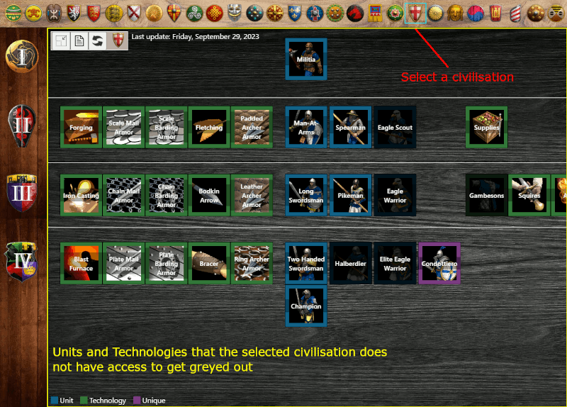

# aoe-twools
Tool for filtering civilisations of the game **Age of Empire 2** based on units and technologies of your choice  
[aoetwools.firebaseapp.com](aoetwools.firebaseapp.com)

## Features

  
  Key features  

- **Filtering**: clics on **units** and **technologies** in the main frame remove **civilisations** that do not have access to them in the top list.
  

- **Tech tree**: clicking a **civilisation** in the top list displays its technology tree (by greying out **units** and **technologies** that this **civilisation** do not have access to)
  

- **Information**: hovering a **civilisation** in the top list, or a **unit** or a **technology** in the main frame display a panel with detailed information
  

  

  
  Other features  

- **Fully upgraded and Excluded**: Hovering over the top right button in the top **civilisation** list shows 2 options that can be checked:
  - Show Fully upgraded: checking this option displays the list of **civilisations** that have access to all selected **Units** and all their corresponding **Upgrades**
  - Show Excluded: checking this option displays the list of **civilisations** that do not satisfy the current filter
  

- **Main frame options**: at the top left corner of the main frame are 3 different buttons
  - Change the size of the icons: clicking the first button changes the size of all **Units** and **Technologies** alternating between normal and small sizes
    

  - Information panel: clicking the second button changes the display mode of the tooltips for **Units** and **Technologies** between *none* (no tooltip will appear), *display* (tooltips will appear on hover and disappear on leave) and *locked* (tooltips will appear on hover and maintain as long as the cursor is hover the panel allowing the user to check further information in the panel)
    

  - Reset filters: clicking the reset button removes all filters (**Civilisations**, **Units** and **Technologies**)
    

- **Language**: Two languages are available *English* and *French*

  

## Contribute

You can contribute multiple ways and that do not necessary require technical skills:
  - [Reporting Bugs](docs/CONTRIBUTING.md#reporting-bugs)
  - [Suggesting Enhancements](docs/CONTRIBUTING.md#suggesting-enhancements)
  - [Your First Code Contribution](docs/CONTRIBUTING.md#your-first-code-contribution)
  - [Improving The Documentation](docs/CONTRIBUTING.md#improving-the-documentation)

For more details see [Contribution guidelines for this project](docs/CONTRIBUTING.md)

---

## Available Scripts

In the project directory, you can run:

### `npm start`

Runs the app in the development mode. 
Open [http://localhost:3000](http://localhost:3000) to view it in the browser.

### `npm test`

Launches the test runner in the interactive watch mode.

### `npm run build`

Builds the app for production to the `build` folder. 
It correctly bundles React in production mode and optimizes the build for the best performance.

### `npm run deploy`

Deploy the application from the `build` folder to the firebase host. 
Hosted application is reachable here https://aoetwools.firebaseapp.com